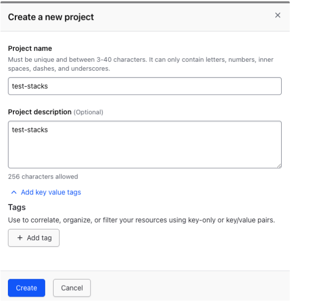
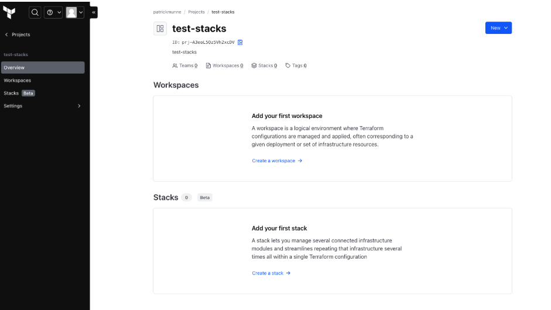
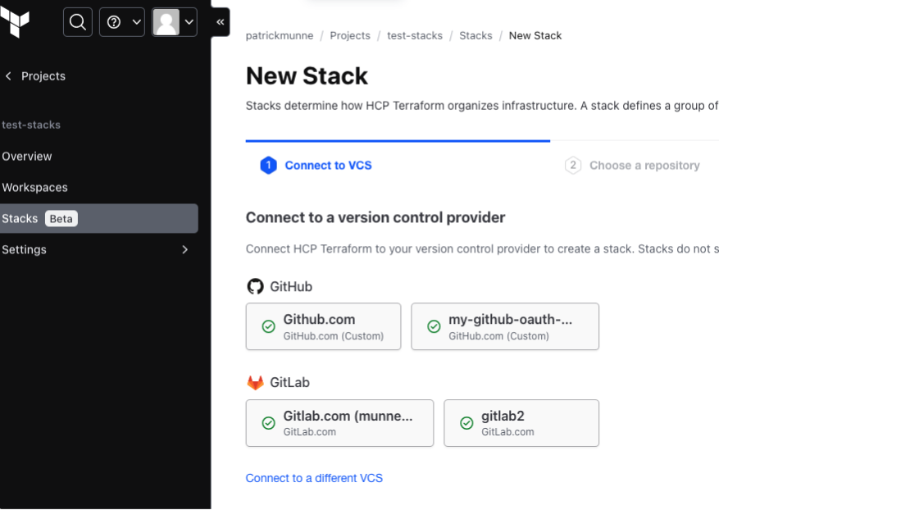
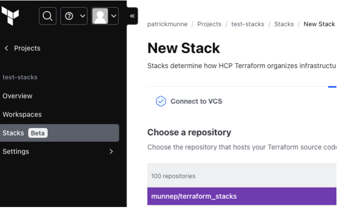
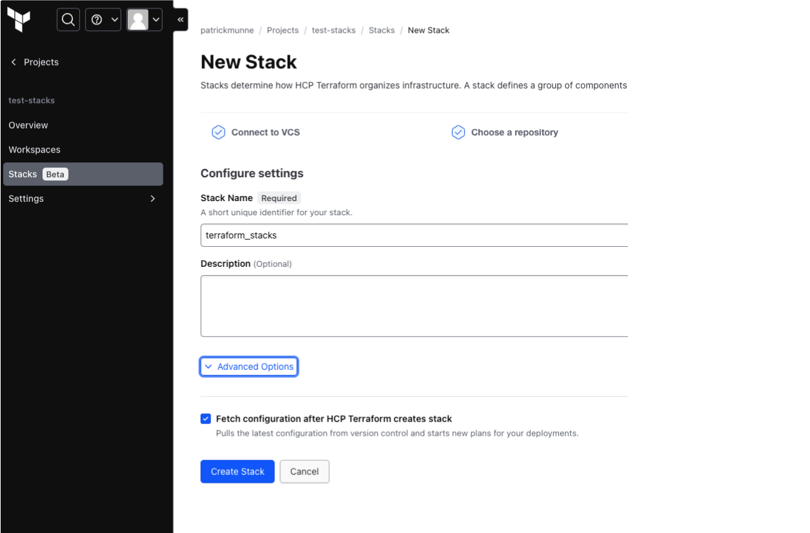
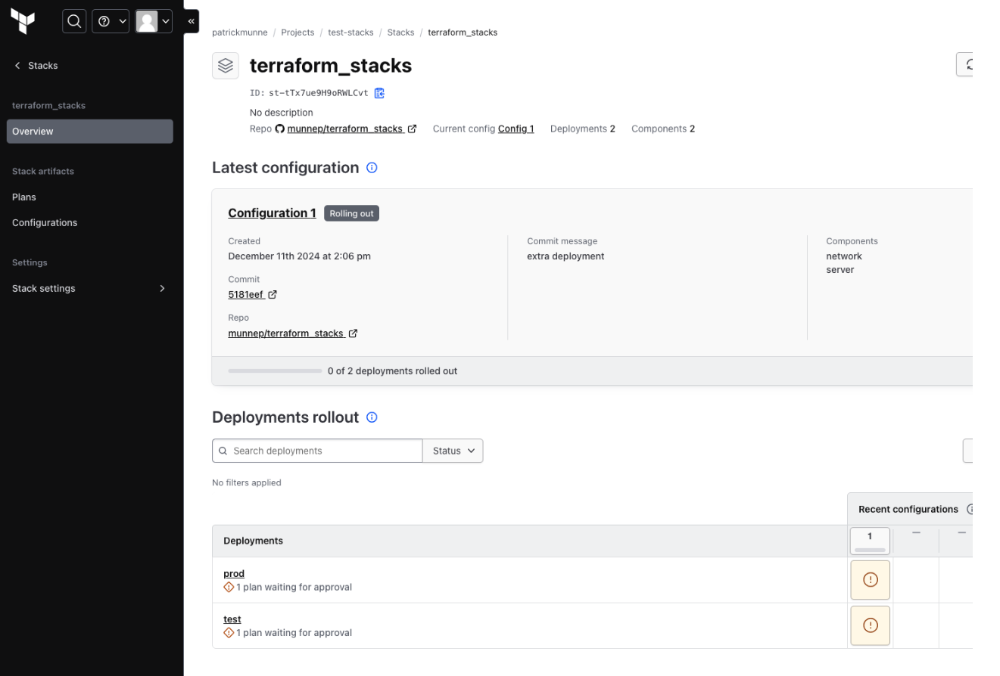
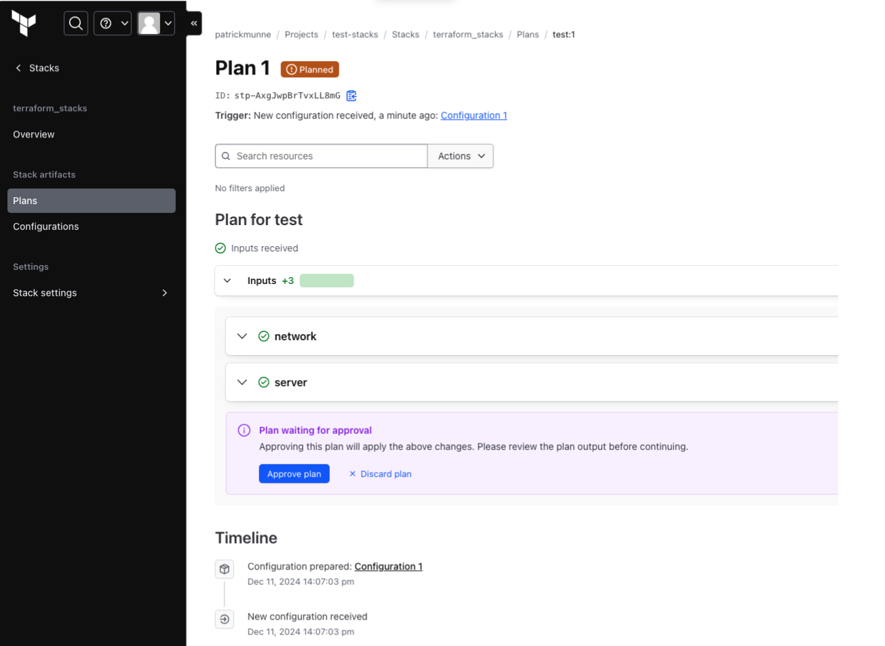
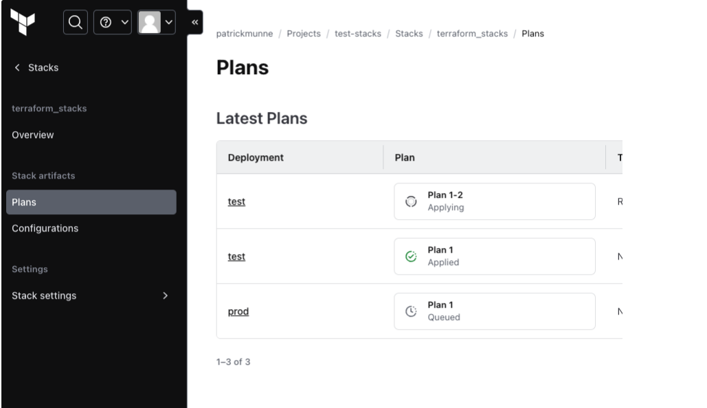

# Terraform Stacks

This repository contains Terraform stacks configuration to test the Stacks feature within Terraform Cloud/Terraform Enterprise. The example code will have 2 deployments and 2 components each. It only uses null resources so there is no additional configuration necessary regarding cloud (AWS/Azure/GCP) authentication. 

# Prerequisites

- Have Terraform Enterprise/Terraform Cloud available
- Have a VCS connection configured in your Terraform Enterprise/Terraform environment
- Fork this repository to your own VCS

# How to

- Login to Terraform Enterprise/Terraform Cloud
- Create a new project (to make it clear what we are working on)  
   

- Select add your first stack  
  
- Connect to Github using VCS where the repository is located  
  
- select the repository  
   
- accept the defaults  
  
- you will see the first deployment
  
- you can apply each deployment
   
- You can see what it is doing for the stack at that point in time
   
